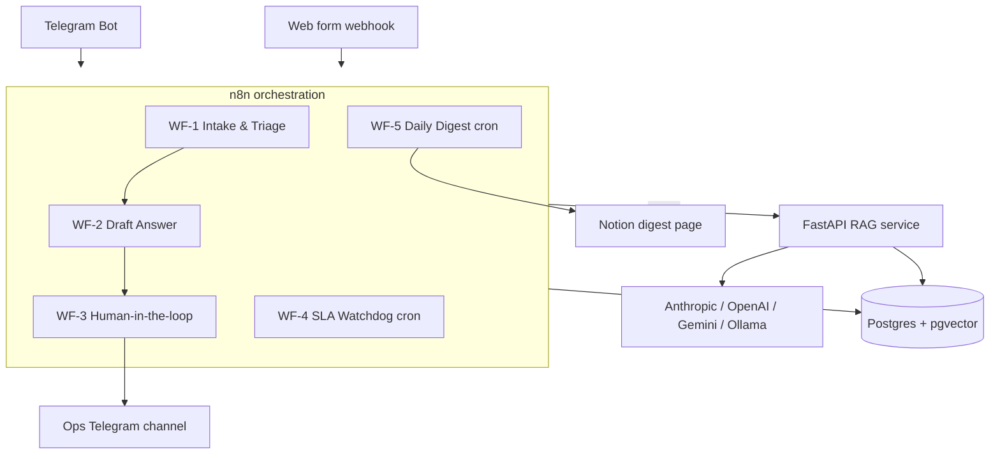

# OpsPilot


An AI support-triage and ops-automation hub for a fictional SaaS company. OpsPilot ingests
support requests from Telegram and a web form, triages and drafts grounded answers over a RAG
knowledge base, auto-sends high-confidence replies, routes the rest to a human operator with
one-tap Approve/Edit/Reject, watches SLAs on stale escalations, and posts a daily LLM-written
digest — with every LLM call logged for cost, latency, and provider.

## Architecture



n8n is a pure orchestrator (ADR-005) — it never calls an LLM directly. Every LLM interaction goes
through the FastAPI service (ADR-001), which owns provider fallback, prompt versioning, cost
logging, and the confidence gate (ADR-002) that decides auto-send vs. human review. Full decision
history in [`docs/decisions/`](docs/decisions/).

## Quickstart

```bash
cp .env.example .env      # fill in real secrets — never commit .env
docker compose up -d      # postgres (pgvector) + rag-api
make seed                 # ingest kb/seed into pgvector
```

`GET http://localhost:8010/health` should return `{"status":"ok","db":true}`. n8n workflows live
in `n8n/workflows/*.json` and sync via `make n8n-sync` against a running n8n instance (see
`docs/infrastructure.md` for a full production deploy runbook — not yet executed against a live
VM as of this writing).

## Live demo

- Bot: `@<your-bot-handle>` _(placeholder — fill in once deployed)_
- Demo video: _(placeholder — 3-minute walkthrough link)_

## Metrics (from production `GET /stats`)

_(placeholder — paste real numbers here once running against production traffic, not dev/eval data)_

| Metric | Value |
|---|---|
| Auto-resolution rate | __% |
| Avg confidence | __ |
| Avg cost/ticket | $__ |
| p95 answer latency | __ s |
| Eval accuracy (`make evals`) | __% |

## Tech stack

Python 3.12 · FastAPI · asyncpg (no ORM — ADR-004) · Postgres + pgvector (ADR-003) · n8n
(workflow-as-code, imported via REST API, never hand-clicked) · Anthropic / OpenAI / Gemini /
Ollama (pluggable provider layer — `LLM_PROVIDER`) · Telegram Bot API · Notion API.

## Testing

- `make lint` — ruff format + check.
- `make test` — L1/L2 tests (fake provider, isolated test database) — 18 tests, all pass.
- `make evals` — L3 eval harness (`evals/`) against a real cheap model: classification accuracy +
  answer groundedness, budget-capped at $0.50/run. See `PROGRESS.md` for current accuracy status
  across providers.
- `docs/TESTPLAN.md` — full test-level breakdown (L1 unit → L5 deploy smoke) with
  Definition-of-Done traceability.

## Out of scope (by design)

Email channel (a connector slot is left for it), fine-tuning, multi-tenant auth, a web admin UI,
Kubernetes. This is a focused portfolio build, not a general-purpose helpdesk platform.

## License

[MIT](LICENSE)
