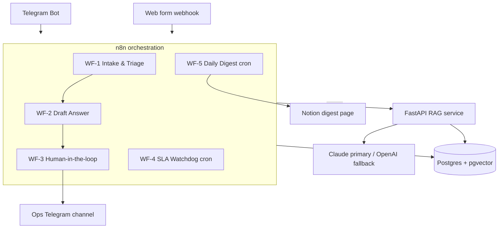

# OpsPilot — Technical Specification (source of truth)

**v1.0 · 2026-07-05.** Agents build exactly this. Deviations require a blocker in `PROGRESS.md` and human approval.
Human-facing context (vacancy analysis, positioning) lives outside this repo and is irrelevant to the build.

---

## 1. Concept

A fictional SaaS company ("Acme") receives support requests via **Telegram** and a **web form (webhook)**.
OpsPilot: (1) ingests requests, (2) triages them with an LLM into validated JSON, (3) drafts answers via
RAG over a knowledge base with a confidence score, (4) auto-sends high-confidence answers and routes
low-confidence ones to a human operator in Telegram with **Approve / Edit / Reject** inline buttons,
(5) watches SLA on stale escalations, (6) posts a daily LLM-written digest (volumes, auto-resolution rate,
USD spend) to Telegram and Notion, (7) logs **every** LLM call with tokens, cost, latency, purpose.

## 2. Architecture



**ADR-001 (locked):** all LLM calls go through the FastAPI service, never directly from n8n —
centralizes fallback, prompt versioning, cost logging, and evals. n8n is a pure orchestrator.

## 3. Components

### 3.1 FastAPI service — `services/rag/`

| Endpoint | Behavior |
|---|---|
| `POST /kb/ingest` | Chunk (~500 tokens, 50 overlap) → embed → upsert `kb_documents` + `kb_chunks` |
| `POST /classify` | Input `{ticket_id, subject, body}` → structured output `{category, priority, sentiment, lang}` validated against a JSON schema; one retry on invalid JSON |
| `POST /query` | Embed question → top-k (k=5) cosine search in pgvector → grounded answer with source citations → `{answer, sources[], confidence}` |
| `POST /summarize` | Input: aggregate stats JSON → short human digest text (UA) |
| `GET /health` | Liveness + DB check |
| `GET /stats` | Totals (optionally scoped to the last N hours via `?hours=`): tickets by status/category/priority, auto-resolution %, avg confidence, sum cost_usd, p95 latency |

- **Provider layer** `app/llm.py`: `complete(purpose, messages, schema=None) -> LLMResult`.
  `LLM_PROVIDER` (env) selects the active provider: `anthropic` (Claude Haiku-class, primary —
  the only provider with a fallback chain, to OpenAI mini-class on 5xx/timeout/connection
  errors), `openai`, `gemini` (gemini-2.5-flash, plain REST API), `ollama` (local, via its
  OpenAI-compatible endpoint), or `fake` for tests (deterministic canned outputs keyed by
  purpose). Every call inserted into `llm_calls`, including the fake provider's.
- **Confidence** = 0.5 × mean retrieval similarity + 0.5 × LLM self-check ("fully supported by context? 0–1").
  Gate threshold `CONFIDENCE_THRESHOLD=0.70` (env).
- **Prompts** in `services/rag/prompts/{classify,answer,self_check,digest}.md` — version-controlled files.

### 3.2 n8n workflows — `n8n/workflows/*.json`

- **WF-1 Intake & Triage:** Telegram Trigger + Webhook Trigger → normalize `{source, external_ref, subject, body}` →
  INSERT ticket (`status='new'`, idempotency key `source+external_ref`) → `POST /classify` → UPDATE ticket →
  IF `priority='urgent'` → alert ops channel → Execute Workflow WF-2.
- **WF-2 Draft Answer:** input `ticket_id` → `POST /query` → IF `confidence >= threshold`: send answer to
  customer, `status='answered'`, `auto_resolved=true`; ELSE `status='needs_human'` → WF-3.
- **WF-3 HITL:** post draft + sources + confidence to ops channel with inline keyboard
  ✅ Approve / ✏️ Edit / ❌ Reject. `callback_query` handling: Approve → send draft, `answered`;
  Edit → capture operator's reply-to text → send corrected, log **both** variants to `messages`;
  Reject → `status='escalated'` + notify.
- **WF-4 SLA Watchdog:** cron */15 min → tickets in `needs_human|escalated` older than 2 h without a
  reminder in the last 2 h → grouped ops reminder; reminder timestamps stored (idempotent).
- **WF-5 Daily Digest:** cron 09:00 Europe/Kyiv → SQL aggregates → `POST /summarize` → post to
  Telegram ops channel + append to a Notion page.

### 3.3 Database — `db/init/01_schema.sql`

```sql
CREATE EXTENSION IF NOT EXISTS vector;

CREATE TABLE tickets (
  id UUID PRIMARY KEY DEFAULT gen_random_uuid(),
  source TEXT NOT NULL,                  -- telegram | webform
  external_ref TEXT,
  subject TEXT,
  body TEXT NOT NULL,
  lang TEXT,
  category TEXT,                         -- billing | technical | account | other
  priority TEXT,                         -- low | normal | high | urgent
  sentiment TEXT,
  confidence NUMERIC,
  status TEXT NOT NULL DEFAULT 'new',    -- new | drafted | needs_human | answered | escalated | closed
  auto_resolved BOOLEAN DEFAULT FALSE,
  last_reminder_at TIMESTAMPTZ,
  created_at TIMESTAMPTZ DEFAULT now(),
  updated_at TIMESTAMPTZ DEFAULT now(),
  UNIQUE (source, external_ref)
);

CREATE TABLE messages (
  id UUID PRIMARY KEY DEFAULT gen_random_uuid(),
  ticket_id UUID REFERENCES tickets(id),
  role TEXT NOT NULL,                    -- customer | ai_draft | operator | system
  content TEXT NOT NULL,
  created_at TIMESTAMPTZ DEFAULT now()
);

CREATE TABLE kb_documents (
  id UUID PRIMARY KEY DEFAULT gen_random_uuid(),
  title TEXT NOT NULL,
  source TEXT,
  created_at TIMESTAMPTZ DEFAULT now()
);

CREATE TABLE kb_chunks (
  id UUID PRIMARY KEY DEFAULT gen_random_uuid(),
  document_id UUID REFERENCES kb_documents(id),
  chunk_index INT NOT NULL,
  content TEXT NOT NULL,
  embedding vector(1536)
);
CREATE INDEX ON kb_chunks USING hnsw (embedding vector_cosine_ops);

CREATE TABLE llm_calls (
  id UUID PRIMARY KEY DEFAULT gen_random_uuid(),
  ticket_id UUID,
  purpose TEXT NOT NULL,                 -- classify | answer | self_check | summarize | embed
  provider TEXT NOT NULL,
  model TEXT NOT NULL,
  tokens_in INT, tokens_out INT,
  cost_usd NUMERIC(10,6),
  latency_ms INT,
  success BOOLEAN,
  created_at TIMESTAMPTZ DEFAULT now()
);
```

### 3.4 Knowledge base seed — `kb/seed/`

8–12 fake Acme product docs (FAQ, billing policy, troubleshooting, API guide), mixed **Ukrainian and
English**, 300–800 words each, internally consistent (same product names, plan names, prices across docs).

## 4. Non-functional requirements

1. **Reliability:** timeouts + retry with backoff on all HTTP hops; intake idempotency via the unique key.
2. **Cost control:** cheap-tier models; daily USD budget guardrail in `llm.py` — exceeding it returns HTTP 429
   with a clear message. Total demo budget < $5; dev budget < $2.
3. **Secrets:** `.env` only; `.env.example` committed; workflow exports sanitized.
4. **Observability:** structured JSON logs; `GET /stats`; the digest doubles as a daily ops report.
5. **Evals:** `evals/tickets.jsonl` (25–30 labeled tickets, UA+EN, incl. ambiguous cases);
   classification accuracy ≥ 85%; groundedness spot-checks; runs in CI.

## 5. Repository layout

```
opspilot/
├── README.md  CLAUDE.md  AGENTS.md  PROGRESS.md
├── docker-compose.yml  .env.example  Makefile  .gitattributes
├── services/rag/{Dockerfile, app/, prompts/}
│   └── app/{main.py, llm.py, retrieval.py, schemas.py, db.py, settings.py}
├── n8n/workflows/          # WF-1..WF-5 JSON
├── db/init/01_schema.sql
├── kb/seed/
├── scripts/{ingest.py, seed_tickets.py, backup.sh}
├── evals/{tickets.jsonl, test_classify.py, test_grounding.py}
├── wiki/                   # LLM Wiki memory (map, INDEX, log, gotchas)
├── ops/AGENT_WORKFLOW.md
├── prompts/                # phase prompts for agents
├── docs/{SPEC.md, TESTPLAN.md, infrastructure.md, decisions/}
└── .github/workflows/ci.yml
```

## 6. Out of scope (do NOT build)

Email channel (leave a connector slot), fine-tuning, multi-tenant auth, web admin UI, Kubernetes.

## 7. Definition of Done (whole project)

1. Live Telegram bot answers a KB question end-to-end in < 15 s.
2. An ambiguous question visibly routes through Approve/Edit in the ops channel.
3. Daily digest posts to Telegram and Notion with real aggregates including USD spend.
4. `make evals` passes (accuracy ≥ 85%); CI green.
5. Deployed on a cloud VM with TLS; nightly backups configured.
6. README: architecture diagram, live-demo handle, metrics table, video link;
   a stranger reproduces locally with `cp .env.example .env && docker compose up -d && make seed`.
